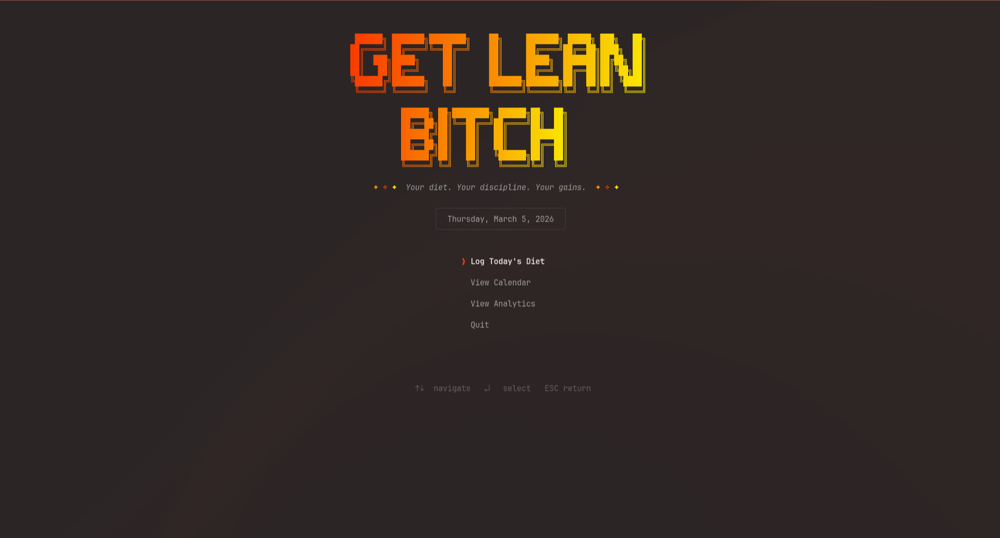
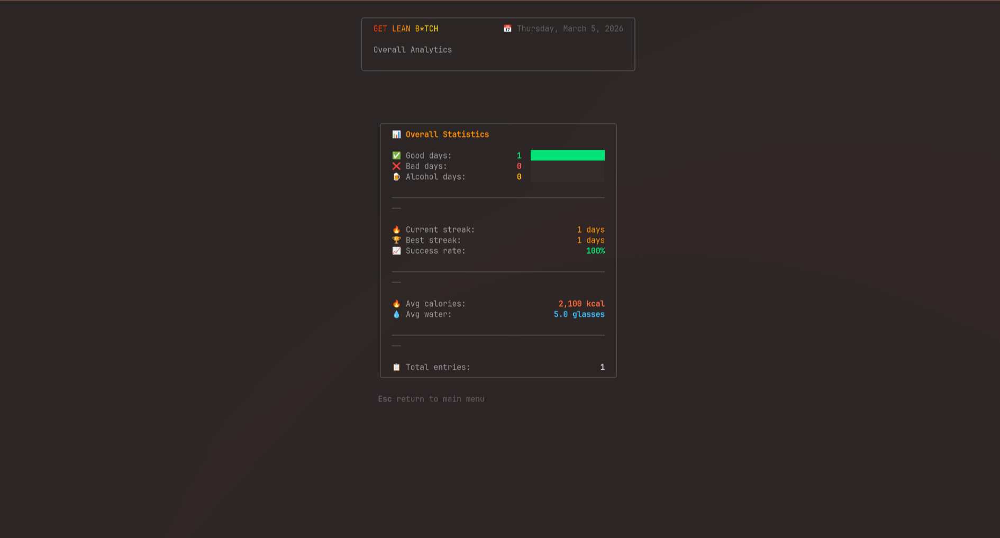
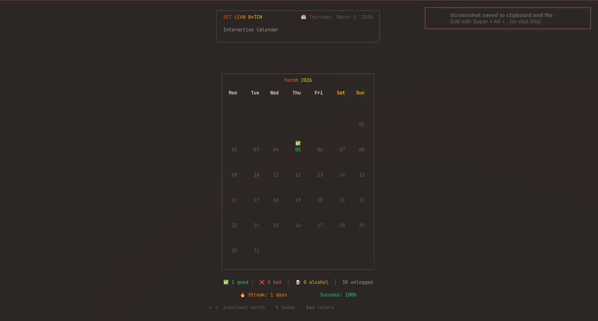

# diet

a dead simple terminal app for tracking what you eat. no fancy dashboards, no accounts, no cloud sync — just you and your terminal.

built this because i kept eating garbage and needed something to keep me honest. if you log it, you think twice before eating that 3rd slice of pizza.

## Install

```bash
npm install -g dietcli
```

then just run:

```bash
diet
```

that's it.

## Screenshots







## Dev

```bash
git clone https://github.com/hlibstrochkovskyi/diet.git
cd diet
npm install
npm run dev
```

## License

MIT